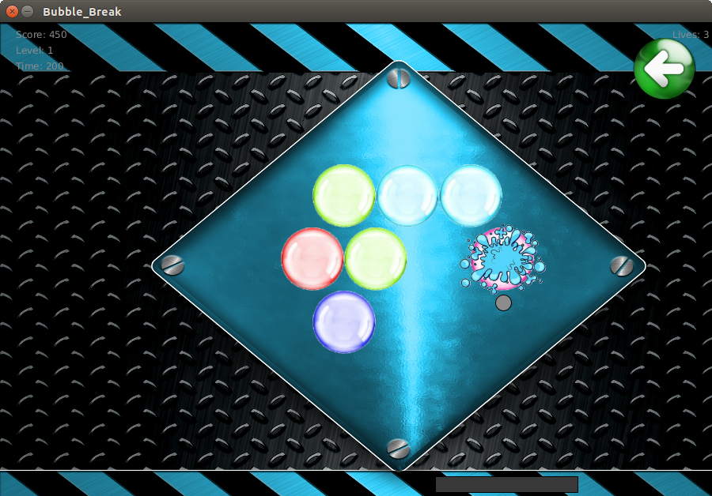
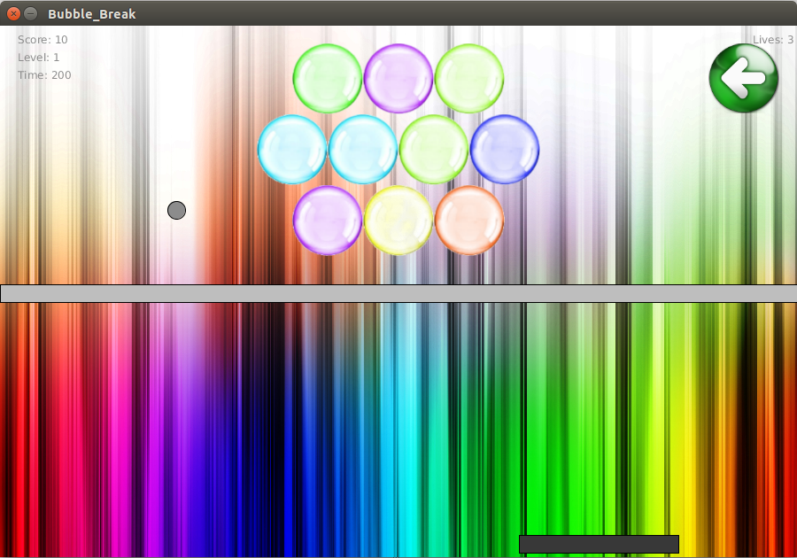
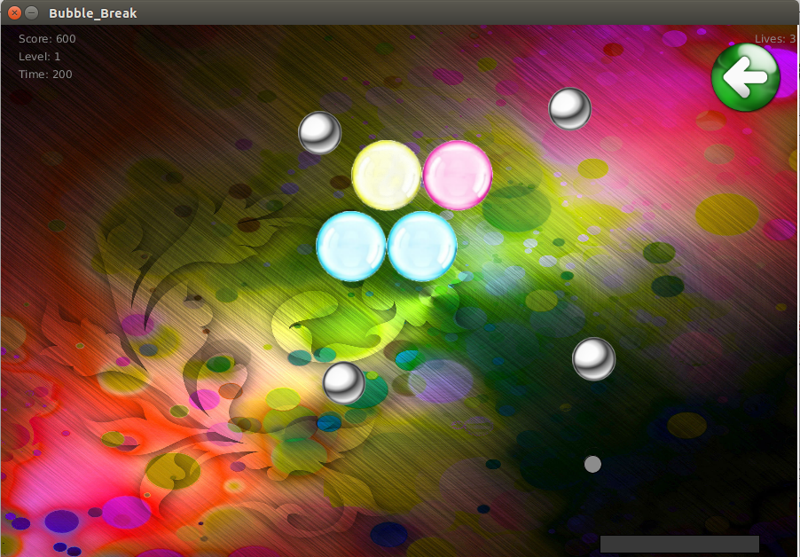

Bubble_Break
=============

A Block Break clone coded up in Processing. With a twist, of course.

The game currently has 3 levels:

1. Keep It Simple
-----------------

Very similar to Block Breaker, the objective here is simply to burst every single bubble on screen before time runs out by repeatedly bouncing Rock (the "hero" of the game) off his trusty sidekick Plat the platform. Doing so gives Rock an extra life, and enables you to move onto the next level.

2. Bounce over the wall
-----------------------

Here, there is a steel wall, which Rock has to scale using a Wall Jump: by first bouncing on one of the edge boundaries of the screen, and the hopping acorss the steel wall. After bursting every bubble, Rock moves onto the next level and gains 2 extra lives.

3. Inside an atom
-----------------

Heer, there are steel spheres orbiting a central nucleus made of bubbles (which seems to be the opposite of what nuclear chemistry professes, but I hope no one is watching...). Rock bounces right off a steel sphere. The objective is to burst all the bubbles before time runs out. After a level is cleared, Rock moves onto the next level with 2 additional lives.

